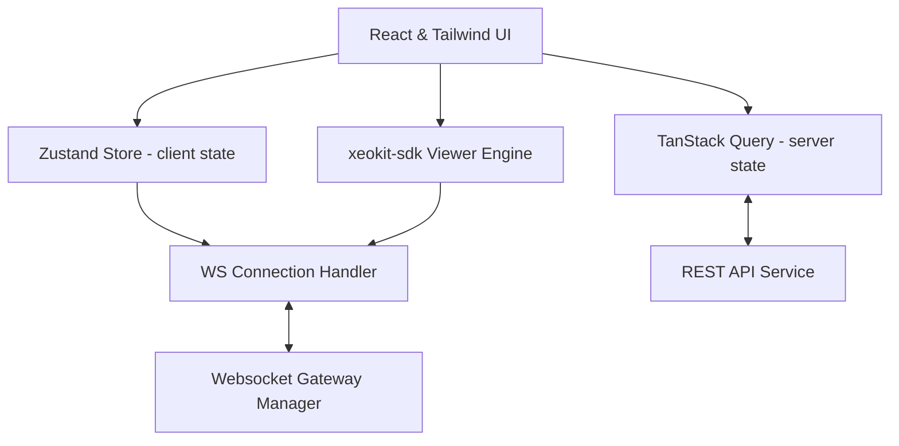

# Open Format 3D Viewer — Frontend

A high-performance, web-based 3D BIM model viewer and collaboration platform built with React, TypeScript, and the xeokit 3D SDK. The application supports standard format rendering, real-time sync, model hierarchy inspections, annotations, and properties analysis.

---

## Architecture Overview



- **Client State**: Powered by Zustand for global UI parameters, camera details, active selections, and cached elements.
- **Server State**: Managed via TanStack Query v5 with auto-caching, query invalidation, and request refetching.
- **3D Engine**: Powered by `xeokit-sdk` (v2.x) rendering 3D IFC geometries and XKT files.
- **Collaboration**: Bidirectional websocket communication protocols to synchronize online viewers and annotations.

---

## Production Features

- **Standard 3D CAD/BIM Rendering**: Native streaming and display of complex `.xkt` (xeokit binary format) and `.ifc` models.
- **Interactive Tree Hierarchy**: View object structures dynamically using virtualized tree components for high performance (>10,000 entities).
- **Element Inspection**: View element metadata properties in real-time.
- **Visual Annotations & Markups**: Drop 3D coordinates-based annotation pins directly on the surface geometry.
- **Real-Time Collaboration**: Cursor tracking and sync indicators across users viewing the same model simultaneously.
- **FPS Health Monitoring**: Dynamic FPS counter that warns users if frame rate performance drops below 30 FPS.
- **Global Error Handling**: Integrated `ErrorBoundary` boundary mapping crashes and generating user-friendly Sentry recovery views.

---

## Folder Structure

```
frontend/
├── dist/                     # Optimized production bundle outputs
├── src/
│   ├── components/           # Core layout shells and global ErrorBoundaries
│   ├── config/               # Application and environment configurations
│   ├── features/
│   │   ├── auth/             # Login, routing, and access token state management
│   │   ├── models/           # File uploading, metadata services, and API hooks
│   │   ├── projects/         # Project workspaces and collaborator listings
│   │   └── viewer/           # 3D canvas engine context, annotations, and toolbars
│   ├── hooks/                # Common hooks (e.g. useWebSocket connectivity)
│   ├── lib/                  # REST apiClient client core and configurations
│   ├── routes/               # Declarative routing maps and route protection
│   ├── main.tsx              # React mounting root
│   └── index.css             # Style system configurations
├── package.json              # Dependencies and scripts definitions
├── tsconfig.json             # Root TypeScript compilation target configurations
└── vite.config.ts            # Vite asset resolution configurations
```

---

## Environment Variables

Configure these variables inside a `.env` file in the root directory:

```ini
# HTTP & WebSocket Backend URL
VITE_API_BASE_URL=https://open-format-3d-viewer.onrender.com

# Sentry DSN configuration for tracking production errors
VITE_SENTRY_DSN=
```

---

## Scripts & Operations

| Task | Command | Description |
|---|---|---|
| **Install Dependencies** | `pnpm install` | Restores lockfile and installs production modules |
| **Verify Compilation** | `pnpm build` | Compiles TypeScript configurations and builds Vite assets |
| **Preview Build** | `pnpm preview` | Serves the local `dist/` production build for staging review |

---

## Deployment

### Vercel Deployment

The application is fully configured for deployment on Vercel:
1. Ensure the root directory of the project points to `frontend`.
2. Configure the **Build Command** as `pnpm run build` (which executes `tsc -b && vite build`).
3. Configure the **Output Directory** as `dist`.
4. Inject production values for `VITE_API_BASE_URL` and `VITE_SENTRY_DSN` in Vercel's Environment Variables panel.
