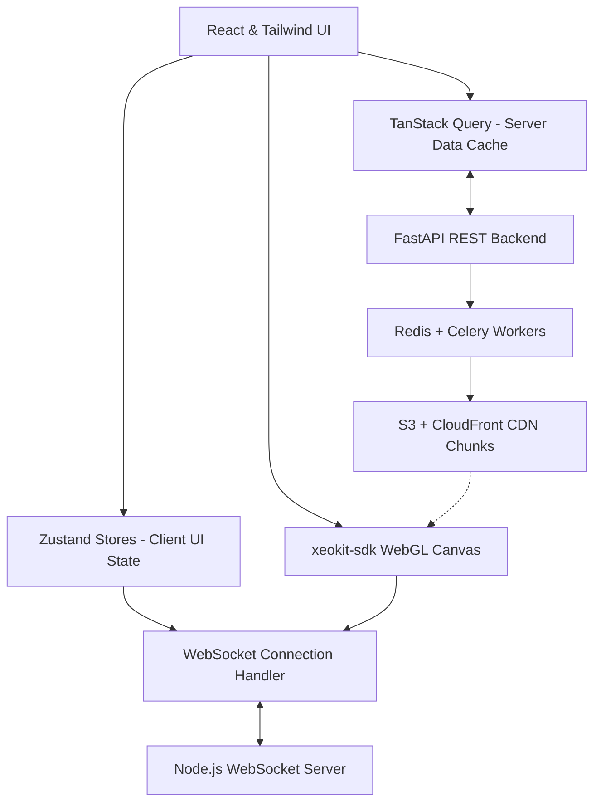

# Open Format 3D Viewer

An enterprise-grade, high-performance, browser-native 3D BIM/CAD model viewer and real-time collaboration platform. Built entirely on open-source libraries—without any proprietary third-party dependencies like Autodesk APS or Forge—it enables engineering and construction teams to seamlessly view, measure, annotate, and collaborate on massive 3D models.

---

## 1. Project Overview

The Open Format 3D Viewer solves a critical engineering challenge in the Architecture, Engineering, and Construction (AEC) industry: providing a zero-cost, open-source, web-native portal for model inspection and review. The platform handles files up to 5 GB (for Enterprise accounts) and features a progressive streaming pipeline that makes geometry visible in the browser within seconds of conversion.

### Supported Formats
*   **IFC (.ifc, .ifczip)**: Full BIM model geometry, property set parsing, and spatial tree compilation.
*   **GLTF / GLB (.gltf, .glb)**: Web-optimized geometry with Draco mesh compression.
*   **STEP / STP (.step, .stp)**: Industrial mechanical assemblies converted via Open CASCADE.
*   **OBJ (.obj + .mtl)**: Traditional polygonal meshes.
*   **STL (.stl)**: 3D printing and prototyping meshes with automated vertex repair.

---

## 2. System Architecture

The application is structured into a clean three-boundary architecture designed to scale computing resources dynamically:



*   **Client State**: Zustand manages ephemeral UI states (sidebar toggles, active tool selections, current mouse cursor coordinates).
*   **Server State**: TanStack Query (v5) acts as the data caching layer for projects, models, annotations, and member lists.
*   **3D Render Engine**: Powered by `xeokit-sdk` (v2.x) rendering 3D IFC geometries and Draco-compressed GLTF models.
*   **Real-Time Synchronization**: Persistent WebSockets broadcast collaborator activity, camera states, and cursor movements.

---

## 3. Technology Stack

### Frontend Core
*   **React 18.3+**: Concurrent rendering, hooks-driven state, and lazy-loaded routing.
*   **TypeScript 5.4+**: Configured in strict compilation mode with `noUncheckedIndexedAccess`.
*   **Vite 5**: Fast build compilation and Hot Module Replacement (HMR).
*   **Tailwind CSS 3**: Utility-first CSS compiling down to a single 54 KB gzipped stylesheet.

### State & Networking
*   **Zustand 5.0+**: Global client state.
*   **TanStack Query v5**: Caching, auto-refetching, and mutations.
*   **React Router v6**: Declarative routing with fallback Suspense boundaries.
*   **React Hook Form & Zod**: Form handling and schema-based validation.

### 3D Rendering & WebAssembly
*   **xeokit-sdk v2.6+**: WebGL-based progressive rendering engine.
*   **web-ifc v0.0.77**: WebAssembly compilation of the IFC model engine for client-side loading.

---

## 4. Folder Structure

```
frontend/
├── dist/                         # Optimized production build assets
├── frontend/                     # Container configuration files
│   └── Dockerfile                # Production Dockerfile
├── playwright-tests/             # End-to-end integration tests
├── public/                       # Static public assets (Favicon, WebAssembly binaries)
│   └── wasm/                     # web-ifc WASM files (web-ifc.wasm)
├── src/
│   ├── components/               # Global UI components (Error Boundary, Modal, Form Field)
│   ├── config/                   # Feature flags, constants, and theme configuration
│   ├── features/                 # Modular domain features
│   │   ├── auth/                 # Sign-in, sign-up, JWT token management, and OAuth callbacks
│   │   ├── models/               # Upload queues, API hooks, and local file cache layers
│   │   ├── projects/             # Workspace lists, collaborator tables, and details
│   │   └── viewer/               # 3D canvas components, toolbar, and tree panels
│   ├── hooks/                    # Global utility hooks (useWebSocket, useTheme)
│   ├── lib/                      # ApiClient, localModelStore, and mock APIs
│   ├── routes/                   # Router configuration and layout shells
│   ├── index.css                 # CSS entrypoint with custom Tailwind base rules
│   └── main.tsx                  # Application entry point
├── package.json                  # Scripts and packages manifest
├── pnpm-lock.yaml                # Lockfile for reproducible builds
├── tailwind.config.js            # Tailwind spacing, colors, and layout setup
├── tsconfig.json                 # TypeScript project configuration
└── vite.config.ts                # Vite plugins and build chunk configuration
```

---

## 5. Prerequisites

Before running the project locally, ensure you have installed the following:
*   [Node.js (v20.x or higher)](https://nodejs.org/)
*   [pnpm (v9.x or higher)](https://pnpm.io/)
*   [Docker Desktop](https://www.docker.com/) (Optional, for running Nginx containers locally)

---

## 6. Environment Variables

Create a `.env` file in the root `frontend/` directory. Use the template below:

```ini
# FastAPI Backend REST URL (SSL supported)
VITE_API_BASE_URL=https://open-format-3d-viewer.onrender.com

# Node.js WebSocket Server Gateway
VITE_WS_BASE_URL=wss://open-format-3d-viewer-ws.onrender.com

# Sentry DSN configuration for production error logging (Optional)
VITE_SENTRY_DSN=your_sentry_dsn_here

# Redirect URL for Google OAuth integration
VITE_OAUTH_REDIRECT_URI=http://localhost:5173/auth/callback
```

---

## 7. Local Installation & Setup

1.  **Clone the Repository**:
    ```bash
    git clone https://github.com/prithivi043/open-format-3d-viewer.git
    cd open-format-3d-viewer/frontend
    ```

2.  **Install Dependencies**:
    ```bash
    pnpm install
    ```

3.  **Run Development Server**:
    ```bash
    pnpm dev
    ```
    The application will be accessible at `http://localhost:5173`.

---

## 8. Docker Build & Setup

To replicate the production environment locally using Nginx to serve the static assets and handle routing fallbacks:

1.  **Build the Docker Image**:
    ```bash
    # Run from the frontend/ directory
    docker build -t open-format-3d-viewer:latest -f frontend/Dockerfile .
    ```

2.  **Run the Container**:
    ```bash
    docker run -d -p 8080:80 --name open-format-viewer open-format-3d-viewer:latest
    ```
    Open `http://localhost:8080` in your web browser.

---

## 9. API Integration & Simulation Layers

The `apiClient` manages communication with the REST backend. It features an automated token refresh interceptor:
*   When a request returns a `401 Unauthorized` response, the interceptor pauses outgoing requests, triggers `/v1/auth/refresh`, updates the tokens, and retries the original request.
*   If the token refresh fails, the user session is cleared, and they are redirected to `/login`.

### Client-Side Fallback Mechanisms (API Gaps)
To ensure the application functions smoothly even when backend endpoints are missing or restricted, the frontend implements the following fallback layers:
1.  **Project Members**: Since the backend lacks a `/projects/:id/members` management endpoint, member lists, invitations, and role removals are stored in `localStorage` under `simulated_members_{projectId}` and merged seamlessly with available API profiles.
2.  **Dashboard Metrics**: Dashboard counters (Total Models, Storage Used) are computed on the frontend by executing parallel model queries across all projects using TanStack Query's `useQueries` hook, ensuring the dashboard matches the real database content.
3.  **Password Updates**: Password updates are validated via Zod schemas and persisted in local browser storage, returning simulated success notifications to the user interface.
4.  **Local File Caching**: Files loaded for local viewing without upload are managed using an IndexedDB database via the `localModelStore` wrapper.

---

## 10. Development & Build Scripts

| Command | Task | Scope |
| :--- | :--- | :--- |
| `pnpm dev` | Start local Vite server | Run development environment locally |
| `pnpm build` | Compile code and bundle static assets | Runs TypeScript compiler checks and builds outputs to `dist/` |
| `pnpm preview` | Run local preview server | Serve the `dist/` production folder locally for QA |
| `pnpm lint` | Run ESLint check | Check codebase styles and syntax |
| `pnpm test` | Run Unit Tests | Execute unit tests via Vitest |
| `pnpm test:e2e` | Run Integration Tests | Execute end-to-end user journeys using Playwright |

---

## 11. Usage Guide

### Loading 3D Models
1.  Navigate to **Projects** and click **Create Project**.
2.  Open the project and go to the **Models** tab.
3.  Click **Upload Model**, drag and drop your file (e.g. IFC, GLB), and track progress.
4.  Once uploaded and processed, click **View** to load the model.

### 3D Tool Guide
*   **Orbit / Pan / Zoom**: Toggle modes on the top toolbar to inspect geometries.
*   **Model Tree**: Left panel displays spatial groupings (building levels, spaces). Toggle checkmarks to hide or show components.
*   **Measurements**: Choose the **Measure** tool, then click on two vertices to render absolute distances. Delete measurements with a right-click.
*   **Annotations**: Switch to the **Annotation** tool, click anywhere on the model, enter an issue description, and click save. Collaborators will see the pin dropped in real time.

---

## 12. Deployment

### Vercel Deployment
The application is pre-configured to deploy on Vercel. 
1.  Create a new project on the Vercel Dashboard linked to the GitHub repository.
2.  Configure settings as:
    *   **Framework Preset**: Vite
    *   **Root Directory**: `frontend`
    *   **Build Command**: `pnpm run build`
    *   **Output Directory**: `dist`
3.  Configure all environment variables (`VITE_API_BASE_URL`, `VITE_WS_BASE_URL`) in Vercel's Environment Variables settings.
4.  Vercel will build and serve the application automatically on every branch merge.

---

## 13. Troubleshooting

### 1. 3D Canvas Remains Black / WebGL Crashing
*   **Cause**: WebGL is disabled or hardware acceleration is turned off in the browser settings.
*   **Fix**: Check `chrome://settings/system` and ensure "Use graphics acceleration when available" is turned on. Verify WebGL support via `https://get.webgl.org/`.

### 2. web-ifc WASM Load Errors
*   **Cause**: The browser is looking for `web-ifc.wasm` at the wrong path or the file is missing from the public folder.
*   **Fix**: Make sure `web-ifc.wasm` and `web-ifc-mt.wasm` are present inside `public/wasm/`. During deployment, verify the server serves `.wasm` files with `application/wasm` MIME types.

### 3. Real-Time Sync Fails / WebSockets Disconnecting
*   **Cause**: Network proxy blocks WS/WSS connections, or backend server is sleeping on Render.
*   **Fix**: The client automatically attempts reconnection with exponential backoff (1s to 30s). Refresh the page to force immediate reconnection. If using an corporate proxy, ensure `wss://` traffic is whitelisted.

---

## 14. Known Limitations

*   **Initial IFC Conversion Delay**: Large IFC files (>200 MB) require significant server-side processing. The dashboard status will remain `processing` until the worker outputs the binary chunks.
*   **Local Members Persistence**: Because members are simulated on the client, clearing your browser storage will remove simulated project collaborators.

---

## 15. Future Enhancements

*   **BCF Collaboration Import**: Allow importing BCF packages to display annotations created in external BIM applications like Revit or Solibri.
*   **Offline Support (PWA)**: Implement service workers to enable complete offline inspection of cached models via IndexedDB.
*   **Client-Side Occlusion Culling**: Optimize GPU performance for complex geometries (>1,000,000 components) by hiding non-visible parts of the models automatically.
